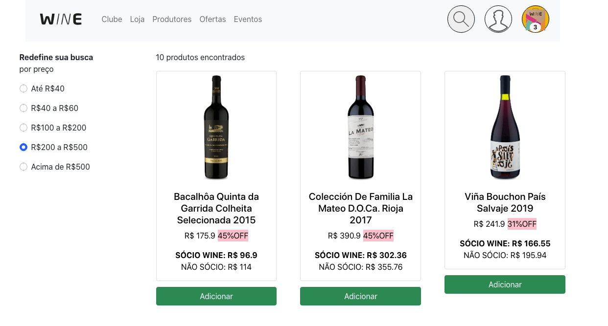

## Projeto Wine App

_[Acesse o deploy do projeto aqui](https://wine-app-gilt.vercel.app/)_

### Contexto

Foi desenvolvido um e-commerce para venda de vinhos, nele é possivel fazer o catálogo de produtos com paginação, fazer a filtragem de produtos por preço, busca pelo nome do produto e adicionar e remover produtos do carrinho.

### Tecnologias usadas

>ReactJs, Context-API, Hooks, JavaScript, HTML, CSS, Bootstrap.

### API usada

_[Currency Quote API](https://documenter.getpostman.com/view/10015622/UVJiiuHi#fe849253-c47a-492f-a860-08350296c570)_

### Instalação do projeto

1. Clonar o link do repositório: ```git clone git@github.com:esaumatias/WINE-APP.git```
2. Instalar as dependência necessárias para o projeto: ```npm install```
3. Iniciar o projeto: ```npm start```

;
